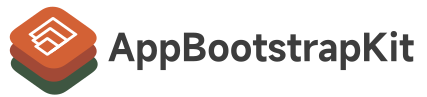

# AppBootstrapKit



AppBootstrap is a framework of help boot swift app with SDL or ImGui and etc.


# How to integrate

This is an SPM-compliant Swift Package: First, add the following line in Package.swift to your package dependencies:

```swift
.package(url: "https://github.com/CmST0us/AppBootstrapKit.git", branch: "master")
```
Then, add the module AppBootstrapKit – where necessary – to your target dependencies.

# Usage

Subclass of `Application` 

```swift
public class MyApp: Application {
    public override func update() {
        // every frame update will invoke this
    }

    public override func setup() {
        // after application setup, will invoke this
    }
}
```

Create instrance

```swift
let config = Application.Configuration(pipeline: .sdl2_imgui, openglVersion: .gles2_glsl100,
        windowName: "MyApp",
        clearColor: (0, 0, 0, 1.0))
let app = MyApp(configuration: config)
app.run
```

# License and Contributions
This package is licensed under the term of the MIT License. Contributions are always welcome!